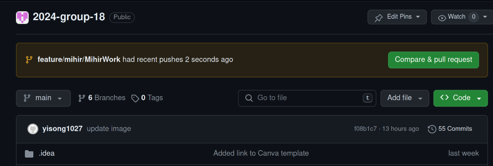
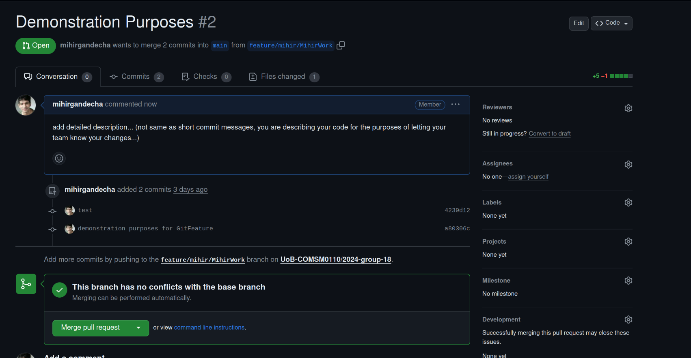

## Creating Git Feature Tutorial 
### Creating branches for your group
### Step 1: Pull Latest Changes
Switch to main branch first and pull latest changes:
```bash
git checkout main
git pull origin main
```

### Step 2: Create a new feature branch 
Make feature branch in similar format for now - note that this command creates the branch AND switches to the new branch created!
```bash
git checkout -b feature/yourname/NameWork
```

### Step 3: Congrats! Branch created - now work on your feature branch!
Make these two commands your best friend:
```bash
#make sure that you are in *feature/yourname/yournameWork
git branch 
```

```bash
#gives you a description if you are of if you have changes.
git status 
#"Clean Working branch" <- a beautiful command you want to look out for (teller for all in-sync)
```

### Step 4: Everytime you make a change... 
Make a change, then run these commands:
```bash
# Make sure you are in your branch first!
git checkout feature/name/nameWork
# Make changes to files
git add .
git commit -m "Any meaningful message"
# Push to your branch!!
git push origin feature/name/nameWork
#Check worked (sometimes doesnt!)
git status
#Look out for that beautiful message
```
## Get used to these commands by lots of practice! 

## Merge Request: 
#### When you are ready to merge your code with others into main (recommended to do once together as a group)
### Step 5: EASY FROM HERE! Switch to your Github team page.
When navigating to your team Git page, you will see changes from each others branches:


Click on "Click & Pull Request"
### Step 6: Creating a Pull Request to your team
Create a detailed description of what you have been working on within your branch, which is then released to your team.


Once you are happy click "Create Pull Request."
### Step 7: Team Review of Pull Request

This details how pull requests are merged to main. Recommended in the beginning to come together to review Pull Requests, and then once comfortable can use Conversation tabs to communicate virtually to one another any disagreement.

Checkout the [Linux Kernel Mailing List](https://lkml.org/)  which shows a list of pull request changes from different members of the development team.



Once everyone in the team is happy to merge changes onto main click "Merge Pull Request."
There should also be an option somewhere to discard changes if unhappy with changes.

### Hope this helps!
Tutorial brought to you by @mihirgandecha :))
