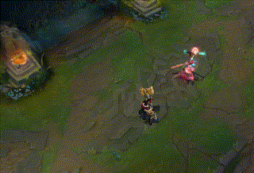

# Our Team

 

# List of 2d / Simple Games

- Subway surfers
- Sonic
- Bonus.com's Xtreme Snowboarding
- Pacman
- Temple Run
- Tetris
- Slay the Spire
- Stardew Valley
- Don't Starve
- This War of Mine
- Icey
- For the King

# Game Ideas
A platforming game. You have various classic power-ups, like super jump and ability to destroy platforms. You also have more interesting ones, like the ability to “time travel” where you can save your state and travel back to that state, similar to Ekko in League of Legends.) These power ups come with trade offs (decreasing the amount of time in the level, making enemies stronger etc.) You lose points when your player collides with a platform. 

Challenge 1 - Time Travel Power Up

Challenge 2 - Other Power Ups (super jump etc.)

Challenge 3 - Accessibility - eg: colour blindness, alternative input methods (sound?, webcam?, eye tracking?)

 
 
A platforming game. Each time you go through the level your previous incarnations show up - doing exactly what they did previously. They must be avoided. The level is designed to create ‘choke points’ that reward future planning (eg: waiting at certain points to give gaps.) Boss fights might require collaboration between the past and future selves (eg: attacking from both sides at once.) This is somewhat inspired by Tenet, Titanfall 2.
- Load up the game, the objective is to get from the START to the END, simple platformer mechanics
- Upon reaching the END, time is inverted, you must then travel back from the END to the START however your past self who first travelled from START→END is also moving through the level (drawing coming soon), they must be avoided at all costs, as interacting with your past self causes a time paradox (how could you of gotten to where you are if you disrupt the path of your former self?)
- Potential difficulty scaling with how many time inversions you can successfully navigate, i.e. how many past iterations of yourself are all moving through the level at the same time, some will be moving backwards in time (relative to you) and others moving forward (relative to you)
  - Or, arguably cooler, include a boss battle where the boss is impossible to kill alone. Instead, you will need to plan and memorise the attacks you make on the first run through the level and combine them with ones you make after time inverts. You will effectively have to fight the boss from both the past and the future at the same time.
      - For example, the boss has a shield which one attack will break, but then requires a follow-up attack to actually damage its HP, and by the time your attack has recharged its shield will have also recharged, forcing you to work alongside your past self
   
Challenge 1 - Saving previous iterations of the player.

Challenge 2 - Level Design and balance (can we create a level designer to make this easier?)
              - how can you design levels that create fun and engaging choke points, it must be fun to traverse on both playthroughs of the level
              - the second time will be interesting due to the presence of your past self, however when first going through it it must present a fun and engaging challenge

Challenge 3 - Designing a boss that requires clever use of the mechanic.

# paper prototype
First idea
https://www.youtube.com/watch?v=U_D2pebtMJo

TODO Include video of second idea

# Requirements
## Ideation, Use-Cases and User Stories

### Use-Case Diagram

### Use-Case Specifications

### User Stories:
- As a casual gamer, I want to have fun.
- As a speedrunner, I want to prove how impressive I am.
- As a puzzle enthusiast I want to play something that rewards me for planning.
- As a person with mobility issues, I want to play the same game as my friends so that I can feel included. 

### Technical Requirements
- Tutorial Screen (how to move, how to trigger traps or button, how to reverse, how to win, get hint when stun in 10 seconds)
- Scoring System / Clear Objective to get full stars
- User interface elements showing the movement of time (the sun?)
- Levels - at least 2.
- Difficulty levels (easy & hard).
- Save the Previous State and reverse it. 

### Week 3: Decide on Final Idea and Collect Requirements

        
## Week 4 Task: Add requirements section to report
#### Introduction:
When planning how we wanted to paint a story of our final idea, we first thought that creating 3 diverse persona stories would allow for a customer-orientated game idea, that takes into consideration multiple users. Therefore, we started out with designing 3 User-stories (on Canva - to save words), and evaluate the use case to facilitate a clear use-case model. This task was discussed as a group, and split, where Ali and Mihir discussed Persona design, and Yi, Kai, and Tom would model the use-case diagram.

##### User Story 1:

##### User Story 2:

##### User Story 3:

#### Challenges Encountered:
Mihir: Found that lots of excitement and passion about game code and features within group, however had to bring group back to making sure we are completing the weekly report tasks first. This was a problem as persona became puzzle-solver gamer, competitive gamer... whereas it should tell a story. As a remedy, I organised meetings such that 1 hour meeting on Monday booked (in Library group room) in afternoon such that new concept is fresh in minds after class, and Wednesday 2-hour sessions are coding. This ensures that we stay user-orientated and don't drift from SE concepts learnt in class, as customer experience should be prioritised, then functionality, and when objective is achieved, exciting innovation comes after. Lesson learnt: Stay discipled as a group, stick to planning and becoming user-orientated, then coding excitement comes after!

Mihir (Git): Merge conflict as we are all using main. Managed to resolve conflict with no issues. Told group feature (branch) command to prevent future conflicts.

#### Evaluation:
As a result of detailed persona creation using a visual passion board and gamer personality, we discovered that as we drifted off to cool features in game, Ali suggested having a disability feature to increase the potential reach of the game. Evidencing the importance of requirement engineering planning as a priority, before jumping to code.
