TODO: update figure numbers

TODO: add GIFS

TODO: search for any remaining TODOs or XXX in the readme.

DONE:
TODO: include GIFs of feasibility studies.
TODO: include paper prototype GIF.
TODO: include YiOldGame GIF.
TODO: insert picture of linux error.
TODO: Include GIF of gameplay in disability mode.

  
     
  </a>

# Game Setup Instructions

To play our game, you must install Processing and the following libraries: "Video", "JavaFX",  "Deep Vision", and "Sound". Here's how to do it:
1. **Open Processing**: Launch the Processing application on your computer.

2. **Library Manager**: Open the Library Manager by selecting “Import Library...” from the “Sketch” menu, then choose “Add Library...”.

3. **Install Libraries**:
   - Use the search bar to find each of the following libraries:
      - "Video"
      - "Deep Vision"
      - "Sound"
      - "JavaFX"
   - Click "Install" for each library.

4. **Learn More**: For additional guidance on installing libraries, check out [this tutorial](https://processing.org/tutorials/video).

Once you've installed Processing and the required libraries, you're all set to run the game!

# Video
<a href="https://www.youtube.com/watch?v=e0jlz4I9GUk" title="Click to Watch!">
    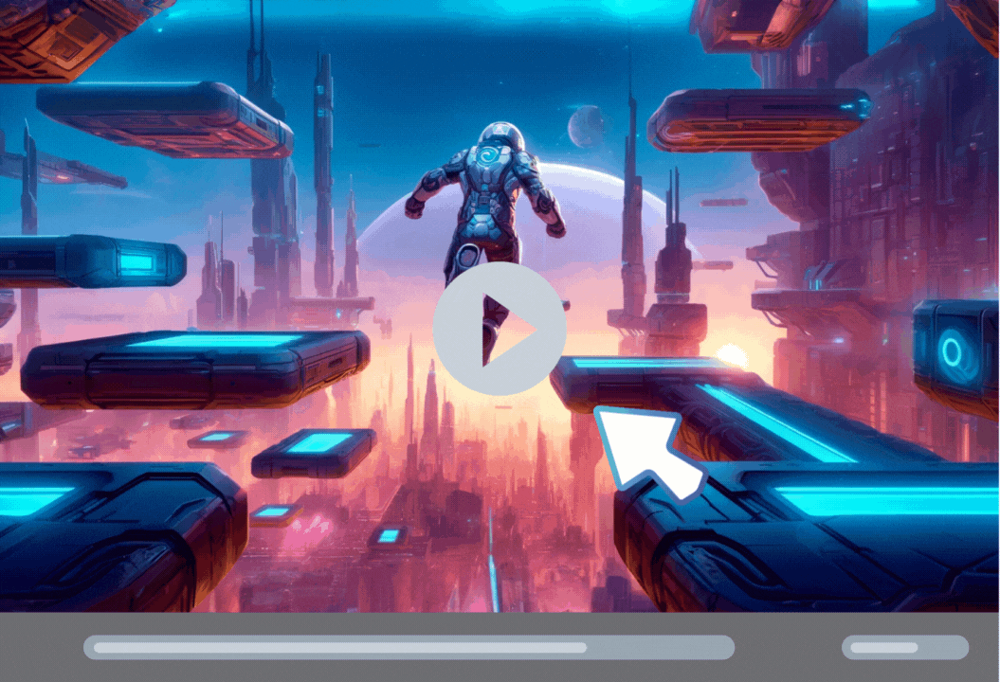
</a>

# Table of Contents
- [1. Development Team](https://github.com/UoB-COMSM0110/2024-group-18?tab=readme-ov-file#1-development-team)
- [2. Introduction](https://github.com/UoB-COMSM0110/2024-group-18?tab=readme-ov-file#2-introduction)
- [3. Requirements](https://github.com/UoB-COMSM0110/2024-group-18?tab=readme-ov-file#3-requirements)
- [4. Design](https://github.com/UoB-COMSM0110/2024-group-18?tab=readme-ov-file#4-design)
- [5. Implementation](https://github.com/UoB-COMSM0110/2024-group-18?tab=readme-ov-file#5-implementation)
- [6. Evaluation](https://github.com/UoB-COMSM0110/2024-group-18?tab=readme-ov-file#6-evaluation)
- [7. Process](https://github.com/UoB-COMSM0110/2024-group-18?tab=readme-ov-file#7-process)
- [8. Conclusion](https://github.com/UoB-COMSM0110/2024-group-18?tab=readme-ov-file#8-conclusion)
- [9. Acknowledgements](https://github.com/UoB-COMSM0110/2024-group-18?tab=readme-ov-file#9-acknowledgements)
 
# 1. Development Team

  <b>Figure 1</b> 
  <i>Team Picture Week 1 with Team Role</i> 
  

### Team Roles (from left to right of image):

| Name    | Role          | Contributions |
|---------|---------------|---------------|
| `Mihir` | `Dev Ops Lead`  | Built out our tooling and was our in-house GitHub expert, pioneering our crucial PR-based workflow to minimize Git related issues. |
| `Tom`   | `Lead Designer` | Created interactive iPad demos for potential levels and provided expert analysis during playtesting. |
| `Ali`   | `Scrum Master`  | Encouraged team communication and evaluated tasks for sprint prioritization, ensuring smooth workflow. |
| `Yi`    | `Developer`     | Contributed significantly to game development and shared expertise, enhancing the team's development skills. |
| `Kaiyan`| `Developer`     | Focused on dynamic tooltips in the tutorial level, improving player comprehension and engagement. |

# 2. Introduction 
### About Oiram:

  

Oiram is a single-player, platform-oriented game that integrates Super Mario-style missions and a time-travel feature. Our spaceman must navigate obstacles such as explosives and determine the most efficient path through the game. But, there's a twist: the Tardis object allows for time reversal!

### How to Play:

  

    <b><i>Use the arrow keys or WASD to direct your spaceman: D/A for lateral movement, W or Up to ascend.</i></b>
  

  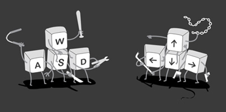

**The Mission:**
Navigate levels, dodge obstacles, and interact with objects like gates, switches, and the Tardis to activate mechanisms and portals.

  <table style="border-collapse: collapse; text-align: center; width: 60%; margin: 0 auto;">
    <caption>
      <b>Figure X</b> 
      <i>Oiram Game Objects</i>
    </caption>
    <tr>
      <th>Category</th>
      <th>Image</th>
      <th>Description</th>
    </tr>
    <tr>
      <td>Gates</td>
      <td>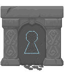</td>
      <td>Act as portals to the next level.</td>
    </tr>
    <tr>
      <td>Switches</td>
      <td></td>
      <td>Toggle to open doors.</td>
    </tr>
    <tr>
      <td>Tardis</td>
      <td>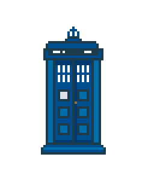</td>
      <td>Device to invoke time reversal.</td>
    </tr>
  </table>

**Obstructions:**
Avoid explosives and pits to survive.

**How to Win:**
Open and enter the door, mastering gravity and momentum to navigate through the level, taking into account the actions of your past self.

### Oiram Game Inspiration:
Oiram's narrative complexity is inspired by Tenet, the timeless platforming of Super Mario, and the temporal challenges of Braid, offering a unique gameplay experience.

### Why Play Oiram?
Oiram stands out by combining classic platforming with innovative time manipulation and prioritizing accessibility with features tailored to a range of player needs.

# 3. Requirements 
### Requirement Engineering

Requirements Engineering (RE) is a communication mechanism that ensures that client needs are prioritised during early-stage design of the Software Design Life Cycle (SDLC) (Rasheed et al., 2021, pp. 1–2). RE holds particular significance in game development, where a postmortem analysis of software engineering conducted by Petrillo (2009, pp. 18–20), finds that 75% of game development case studies reported the most common issues are unrealistic or ambivalent scope and feature creep.

  <b>Figure X</b> 
  <i>Petrillo's (2009) study mapping problems found in Game Development to their occurrences.</i> 
  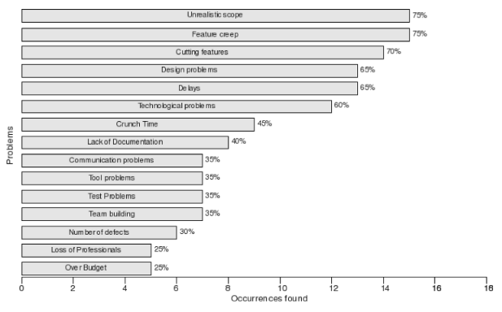
   

<h3>Ideation Processing</h3>

  <b>Figure X</b> 
  <i>Week 2 Brainstorm several game ideas.</i> 
  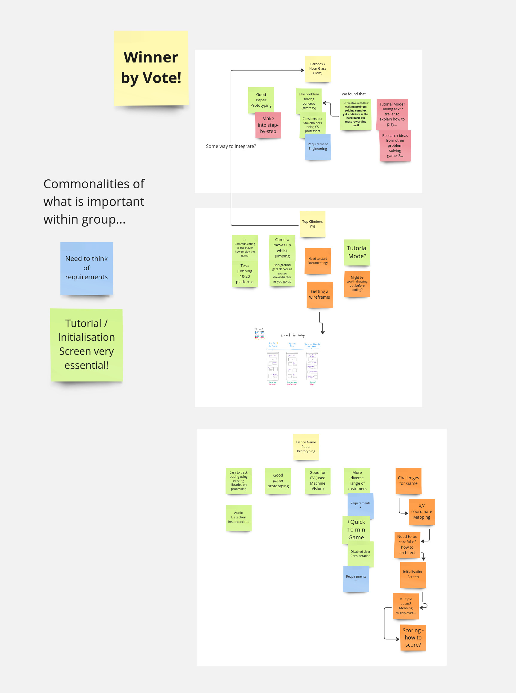
   

    In our ideation phase, we used 
    <a href="https://miro.com/app/board/uXjVNv7hy3o=/?share_link_id=24285523794" target="_blank">Miro</a> 
    (Figure 4) and 
    <a href="https://docs.google.com/document/d/1oLEtyGP2DT71ntCW57uqrKU6U0Af0hguWeTmZLABD5E/edit?usp=sharing"Docs target="_blank">Docs</a>
    to brainstorm two initial game ideas. We were fairly confident that we wanted to include some sort of time travel element. As none of us had experience in Processing, we conducted a series of feasibility studies. This helped us be confident that certain ideas were possible (for example, collisions or controlling the character with webcam input).

One of these feasibility studies evolved into a playable prototype, and we were able to perform user testing (Figure X). This was a game where a user could "skip back" in time at will - allowing themselves to repair damage or avoid death. 

  <b>Figure X</b> 
  <i>Basic Past Player Feature Programmed Early During Project</i> 
  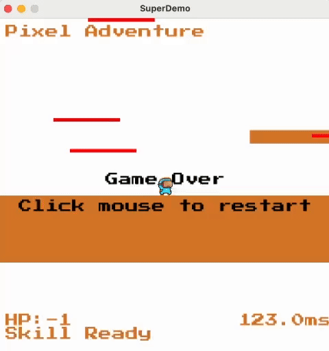
   

Unfortunately, users found it to be "complicated" and "hard to understand what to do." We discussed various ways to mitigate this with User Interface design. Eventually, we took a vote and made the difficult decision to pivot to a new version of the time travel concept, which, based on user testing of our <a href="https://www.youtube.com/watch?v=U_D2pebtMJo" target="_blank">Paper Prototype</a>, we determined that users would be better able to understand with minimal hints.

  <b>Figure X</b> 
  <i><a href="https://www.youtube.com/watch?v=U_D2pebtMJo" target="_blank">Paper Prototype</a></i> developed during Workshop Three
    
  

  <b>Figure X</b> 
  <i>Digital Paper Prototype drafted after Workshop Three</i> 
  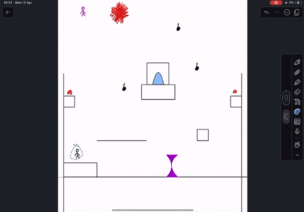
   
 

One of these feasibility studies evolved into a playable prototype, and we were able to perform user testing. This was a game where a user could "skip back" in time at will - allowing themselves to repair damage or avoid death. 

  <b>Figure X</b> 
  <i>Feasibility Study: Test of skipping backwards</i> 
  

Unfortunately, users found it to be "complicated" and "hard to understand what to do." We discussed various ways to mitigate this with User Interface design. Eventually, we took a vote and made the difficult decision to pivot to a new version of the time travel concept, which, based on user testing of our <a href="https://www.youtube.com/watch?v=U_D2pebtMJo" target="_blank">paper prototype</a>, we determined that users would be better able to understand with minimal hints.

  For the game genre, our group gravitated towards platforms (similar to Mario) and puzzle problem-solving genres, creating a consensus for a game that marries these genres with a Tenet-style narrative twist. During week 3 of designing paper prototypes of the ideas, Dr. Bennett provided feedback and observed similarities between our concept and the Steam game 
    <a href="https://store.steampowered.com/app/1416720/Brain_Games/" target="_blank">Braid</a>.
    This further fueled this idea, which intrigued us with its potential for innovative gameplay mechanics. 

### Identifying Stakeholders (Onion Model)

  <b>Figure X</b> 
  <i>Onion Model of Oiram Game (adapted from Alexander, 2004, p. 223, Figure 1)</i> 
  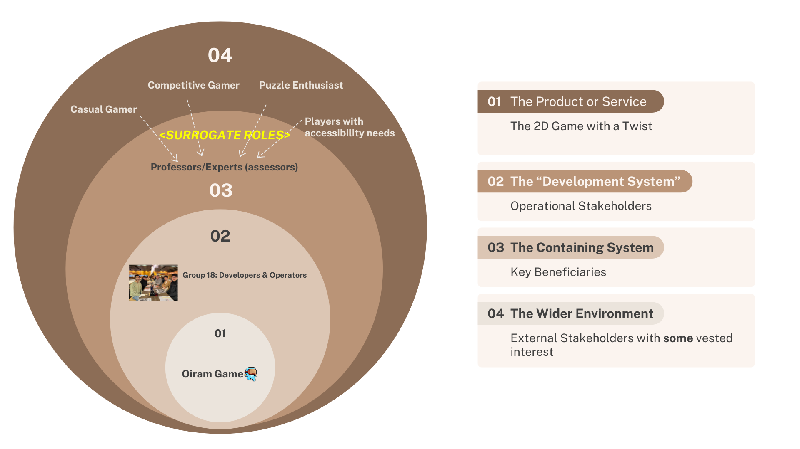
   

**Surrogate Roles**

A key finding from our onion model was our observation that our lecturers have "surrogate roles" (Alexander, 2004, p. 227). Surrogates represent other people or groups. For example, a lawyer represents a client, or a government official represents the public. This concept allowed us to understand that while lecturers weren't direct users of our Game, they stood in for a broader group. Therefore, they not only provided feedback and evaluated the project's success but also represented types of gamers, which gave us our four user stories, shown in the model above.

This was advantageous, especially later when testing the Game and conducting more TLX tests/think-aloud, as we were able to interview anyone in labs/close friends and family (see Section 6), creating the implication that surrogate roles significantly affect data collection. Although mentioned by Alexander, perhaps being more explicit about Surrogate Role strategising and conducting future research in this relationship with product success. It however also poses risks, as surrogates might misinterpret the needs of those they represent. Specifically, our main stakeholders may not have mobility issues. Thus, when presenting to assessors, final feedback may not be representative of accessibility feautures and users with mobility issues, due to reduced expertise and empathy with this feature. Future research can study how we can best utilise Surrogate Roles.

### Identifying Top-Level Needs (User Stories)
To better understand what features we should prioritise, we created user stories.

- As a casual gamer, I want a game that is straightforward to control, allowing me to enjoy the game immediately without a steep learning curve.
- As a puzzle enthusiast, I want a game that gives me an "aha" moment, and rewards my ability to think through a problem.
- As a competitive gamer, I want a platformer game with complex time travel puzzles and challenges that require precise timing and strategy, offering me a satisfying depth of gameplay.
- As a disabled gamer, I want to play games primarily using webcam-based controls, so I can enjoy the same gaming experience as others without the need for traditional input methods.
- As a student with limited gaming time, I want a game with short levels.
- As a commuter, I want a platformer game that provides offline playability, and can be played with one hand when I am traveling.
- As a player seeking variety, I want a game that offers different eras and environments to explore through its time travel theme, each with unique obstacles and aesthetics.
- As a technology enthusiast, I want a game that leverages modern technology like webcam interaction not just for accessibility, but also to create immersive, novel gameplay experiences.

To personalise and keep these user stories in mind, we created several posters with characters to represent these user stories. This kept them at the forefront of our minds and provided an easy shorthand to reference in meetings: "What would Christina think?"

  <b>Figure X</b> 
  <i>User Story One</i> 
  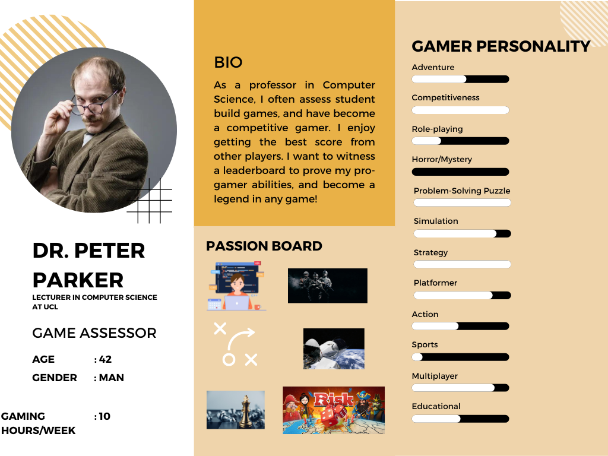
   

  <b>Figure X</b> 
  <i>User Story Two</i> 
  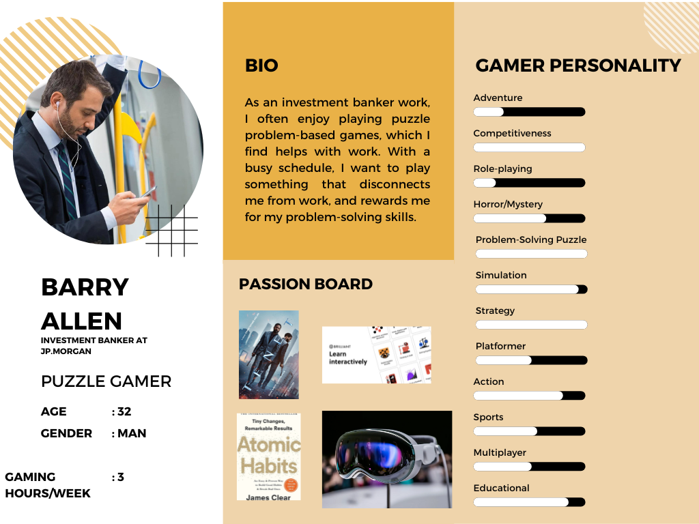
   

  <b>Figure X</b> 
  <i>User Story Three</i> 
  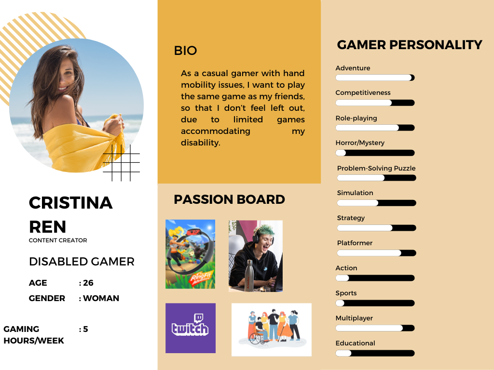
   

### Use-Cases Breakdown 
As our user stories include casual gamers, we understood early on in the game development process the difficulties when making a game for a large group of customers. Therefore, we used a Use-Case Diagram as a guide to inspire the creation of a dual-mode gameplay system with an accessibility mode. While the game uses standard keyboard controls in Non-Accessibility Mode, it uses **Machine Vision** in Accessibility Mode to let players control the game with head motions. This innovation aligns with our commitment to diversity and improves accessibility for those with limited mobility.

Below is our initial interpretation of this, where we posited the idea that the accessibility mode would be made easier on other dimensions. Eventually, we moved away from this idea, as we felt that it was important to our disabled player user story that they were able to play the same game as their friends.

  <b>Figure X</b> 
  <i>Use Case Diagram</i> 
  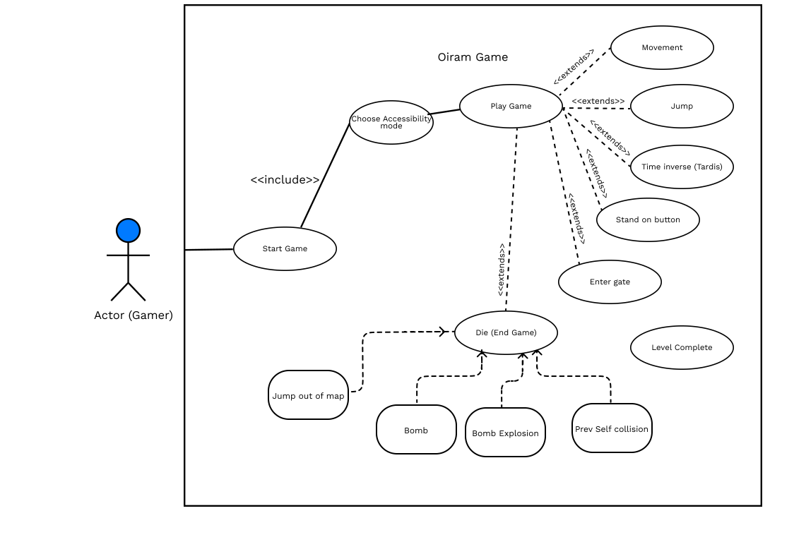
   

### Use-Case Specification

  <b>Figure X</b> 
  <i>Easy Mode (Tutorial) Use Case Specification</i> 

| | Non-Accessibility Mode                                                                                                                            | Accessibility Mode                                                                                                                                                               |
|--------------------------------|---------------------------------------------------------------------------------------------------------------------------------------------------|----------------------------------------------------------------------------------------------------------------------------------------------------------------------------------|
| **Description**                | On screen run-through of the game with **tutorial**, controlled with **keyboard**.                                                                | A screen popup with **accessibility initialisation and tutorial**, controlled by head movement (swaying left or right) and noise for jumping.                                    |
| **Basic Flow**       | **Goal: Complete the level without getting hurt and not touching previous players. If triggered, everything goes back to its previous position.** |                                                                                                                                                                                  |
| Step One                       | User follows screen prompt for *Movement*, pressing Left/Right or A/D keys to run across platforms, later Up/W key for jump.                      | User moves their head to control character and makes a noise to jump. User can follow mini screen on bottom right corner to track if face is detected (no red box) / undetected. |
| Step Two                       | Narration: "There's a magic stone/door on the map." User continues to use keyboard keys to trigger past-present feature, and activate gate.       | "", becoming more familiar with head movement and noice feature, finding best combination that provides best comfort, and game smoothness, for activating gate.                  |
| **Alternative Flow** | **Challenges: Get touched by a previous self, bombs, or bomb explosions leading to game over**                                                    |
| Step One                       | Collision with previous self, bombs, or bomb explosions leads to end of game.                                                                     |  ""                 |
| Step Two                       | If the player stays still for 10 seconds, a hint appears to guide them.                                                                           |  ""    |
| Step Three                     | Interaction with traps results in game over.                                                                                                      |  ""                                                                                                                    |

  <b>Figure X</b> 
  <i>Difficult Mode Use Case Specification</i> 

|                   | Non-Accessibility Mode                                                                                                                                | Accessibility Mode                                                                                                                                                                                                                     |
|-------------------|-------------------------------------------------------------------------------------------------------------------------------------------------------|----------------------------------------------------------------------------------------------------------------------------------------------------------------------------------------------------------------------------------------|
| **Description**   | A run-through of the game with more complex puzzles, under **keyboard** control.                                                            | A run-through with more complex puzzles, using **head movement and sound** to navigate the map.                                                                                                                                        |
| **Advanced Flow** | Try/Error with keys. Difficult mode therefore repeat attempts are expected. User will find best configuration (ie WASD/Arrow keys) to navigate level. | Increasing confidence with head movement and noise feature. At this point most players will understand what environment will produce best UX with movement (ie lighting affecting face recognition), and pitch, sound for player jump. |

# 4. Design 
Having evaluated our potential stakeholders and evaluated a diverse range of User Stories, we now had a sense of the features we wanted to incorporate into our Game design, as well as the Use-Case Diagram/Specification guiding the development of the accessibility features.

A **Class Diagram** provided a systematic view of our Game System, allowing us to plan ahead and template the relationship between objects, which would serve as planning for good **Object-Orientated Design (OOD)** within our source code. To do so, we first wrote down a plan for System Architecture by collaborating in-person through whiteboard sessions. This allowed for the Class Diagram formation to be a seamless process. 

Following the Class Diagram, we worked on forming a **Sequence Diagram**, which would indicate the order of objects working together. This is particularly significant in Game Development, where, after evaluating many classes in our system, the sequence would allow for easy debugging, especially since the Processing IDE has poor debugging facilities. 

# Project Overview

Based on the requirements specification, we developed a system architecture that begins with a user-interface menu. Here, players can start the game, select levels, or activate an alternative control mode tailored for users with disabilities, such as Carpal Tunnel Syndrome. The system employs visual cues to indicate player damage and potential movements in-game.

## Game Mechanics

The complex mechanics of time inversion in our platform-puzzle game necessitated the design of multiple components:

- **Game Object**: Includes several subclasses such as platforms, players, and interactable items.
- **Player Controller**: Manages player interactions and states.
- **Map and Map Controller**: Handle the layout and logic of game levels.
- **Main Class**: Manages the game loop, flags for method calls, and oversees the creation of Player Controller and Map Controller instances. These controllers maintain method control flags and item lists.

### Class diagrams 

  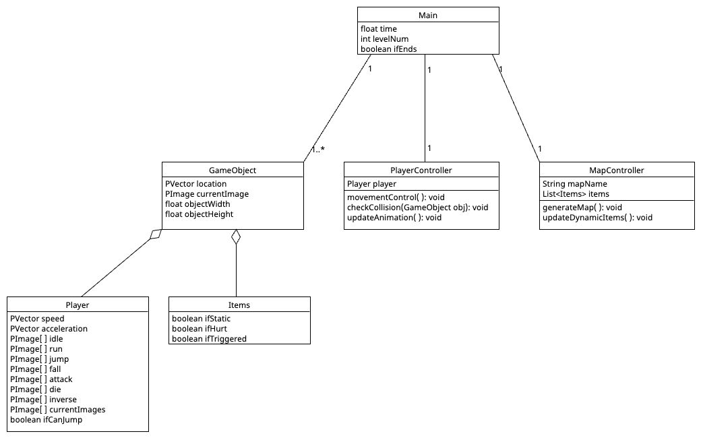
   
  <i>Figure 11: Class Diagram Generated W5 Labs.</i>

  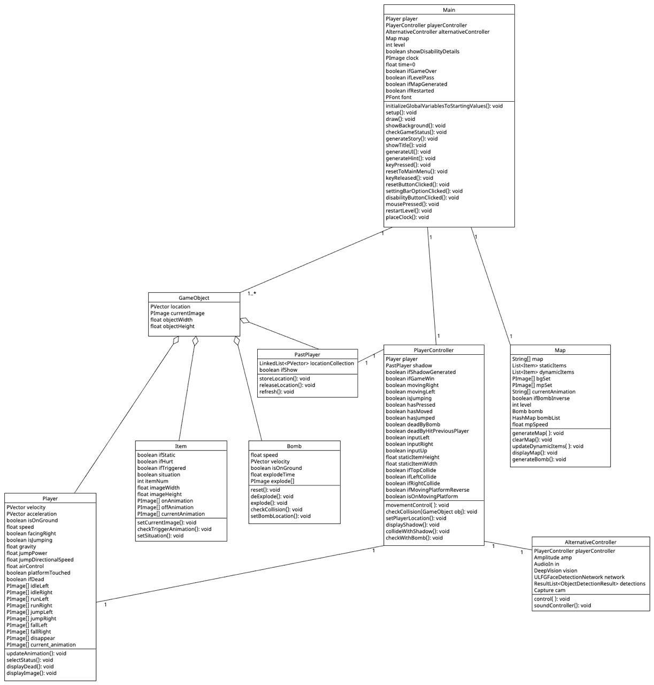
   
  <i>Figure 12: Updated Class Diagram to date.</i>

Figures 11 and 12 indicate how our Class Diagram changed over time. Collisions were an initial difficulty area, our process of which is further described below.

### Behavioural diagrams 

  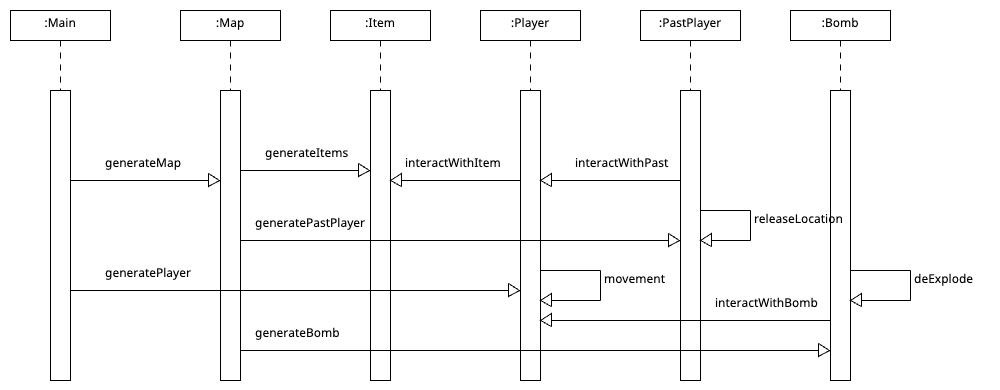
   
  <i>Figure 13: Sequence Diagram</i>

When creating the Oiram game, we embraced agile methods to evolve our game's design. This approach required frequent updates to our system architecture, class, and sequence diagrams, essential tools for visualising and understanding the game's structure and interactions. However, the fast pace of Agile development meant that these foundational documents often needed to catch up to the latest game adjustments, showcasing a key challenge of Agile: maintaining up-to-date design documentation amidst rapid changes.

Looking ahead, to better balance the need for quick adaptations with the necessity of thorough planning, we propose integrating periodic reviews into version control and consider continuously pushing to our report and source code. Although this comes as a challenge because this is our first game project, we experimented late into the project with tools such as [Intelij's Diagram Plugin](https://www.jetbrains.com/help/idea/class-diagram.html) by rewriting .pde to .java, which would have saved time and provided consistency within minimal effort. 

# 5. Implementation

Before starting any of our challenges, we needed to create a basic platformer. First, we created a `GameObject` from which all physical items in the game inherit, as well as a `Player` (which includes specific player behaviour) and a `PlayerController` (which includes the logic for how the player is controlled).

While not one of our official challenges, we found that programming collisions and basic movement were initially quite tricky. For example, our initial approach to jumping caused an issue where users could jump infinitely by holding down the button. Our eventual implementation involved a variable within the `Player` set when they were on the ground. We also included velocity and acceleration variables. For collisions, initially, we had an approach involving an ENUM, several for loops, and several if statements. This approach was verbose and unreliable (occasionally players would fall through the floor!) Our final approach was much simpler and involved using the height and width of the game object, with the conditional collisions logic (for example, pressing the button opens the door) stored inside the `interactDynamicItems` method.

The other element of the game that evolved significantly was the interface for selecting disability mode. Through user testing, we discovered that the Processing video library doesn't work on Linux. Rather than have an unplayable game on Linux, we load the library when the accessibility button is clicked. Our heuristic evaluation required us to include a dynamic loading screen (visibility of system status) since the library takes several seconds to initialise.

Clicking the accessibility button on Linux causes an error message to show up.

  <b>Figure X</b> 
  <i>Console Log of Linux Error</i> 
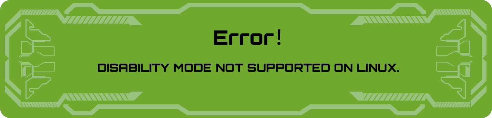

### Challenges

1. **Implementing the reverse time mechanic**

   This was by far the hardest task. We wanted to store not just the previous player's locations but also have that player interact with the environment (for example, opening doors). We created a `PastPlayer` class containing a Linked List of the player's previous locations. We used a frame variable to keep track of time within the object. To reduce the amount of code we had to write, we took advantage of our existing Player class. Since the implementation is the same, this object contained the logic for collisions with buttons and other game objects.

    

   The bomb was even more complex. We created explode and unexplode animations, and we also overrode the `checkCollisions` function to have a broader blast radius.
   
    

3. **Level Design and balance**

   We realized early on that we wanted to build the level map in an extensible way, so the `Map` class contains a function that reads a text file representing the map. This allowed maximal flexibility whilst developing our maps, especially as core game mechanics like jump height were being changed. We opted not to use procedural generation, as we felt control was important given the puzzle-solving nature of the game. This is because we found that many decisions, like where a button is located, can profoundly affect a player's ability to complete a particular puzzle.
   
    
    
    
   This level designer was very helpful when in playtesting. For example, one user found the jump in the tutorial level too challenging to complete, but with a few keystrokes, we were able to change it and immediately gather feedback that the same user found it easier.
   
4. **Accessibility**

   Accessibility was a really important aspect for us, as we have team members with personal experience of their disability locking them out of games. So, we built a way to play the game without keyboard input. Players can lean left and right and make a noise to jump. This was implemented through a machine vision and audio library. Input from the webcam is taken and if the user's head is detected on one side of the screen, the character moves that way. The main challenge of this was efficiency, the first library we used was too slow, as it was doing pose detection. We switched to just detecting the head position, and the game worked. Audio input was taken using Processing’s sound library, and if it spikes over a certain level a jump signal is sent to the player character.

  <b>Figure X</b> 
  <i>Thematic Map of Think Aloud Data</i> 
  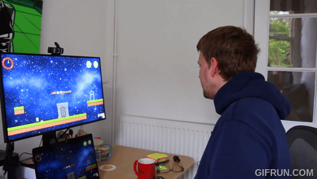

   One other issue we encountered whilst testing this was that the Processing video library isn't supported on Linux machines. To fix this, if the user is on Linux, we  show an error message if they attempt to load accessibility mode. Since loading the libraries takes 5-10 seconds, we needed to implement an additional loading screen to provide adequate visibility of system status.
   
   Whilst the `AlternativeController` class contains about 100 lines of code, it required us to add only a few lines to the rest of the game (from the perspective of the player controller, it is just a few more variables that it handles in the same way as a button press.) This shows that many games that use simple keyboard inputs could have accessibility modes like this one.

    

   In playtesting, some non-disabled players preferred controlling the character this way. This is known as the curb-cut effect; a feature originally built for accessibility can be useful for other players. (Heydarian, 2020)

# 6. Evaluation 

During the development process, it was essential to understand whether the game's fundamental mechanics, namely the movement physics and the time inversion, offered fun gameplay while also presenting a satisfying challenge. To do this, we utilised a mixed-methods approach using inferential statistics enriched by questionnaire data. 

**Qualitative Evaluation**

To gather data regarding the early design of the levels, their difficulty, and the concept of the game itself, we conducted the qualitative evaluation technique of Think Aloud (TA). TA has been shown to be an effective technique in other areas of Human Computer Interaction (Nielsen et al., 2002; Joe et al., 2015). 

Seventeen participants were collected through convenience sampling. Due to easy access to a large pool of other students, we opted to do a Think Aloud over Heuristic evaluation. This also gave us a wider variety of different abilities regarding video games, offering a richer set of data. We asked participants to play the first two levels (level three was still being designed) and recorded their thoughts whilst playing. Following data collection, we identified a series of underlying themes utilising techniques found in Thematic Analysis (Braun & Clarke, 2006). These were then organised into a Thematic Map to aid visualisation (see Figure 14). We will address each theme in turn.

  <b>Figure 14</b> 
  <i>Thematic Map of Think Aloud Data</i> 
  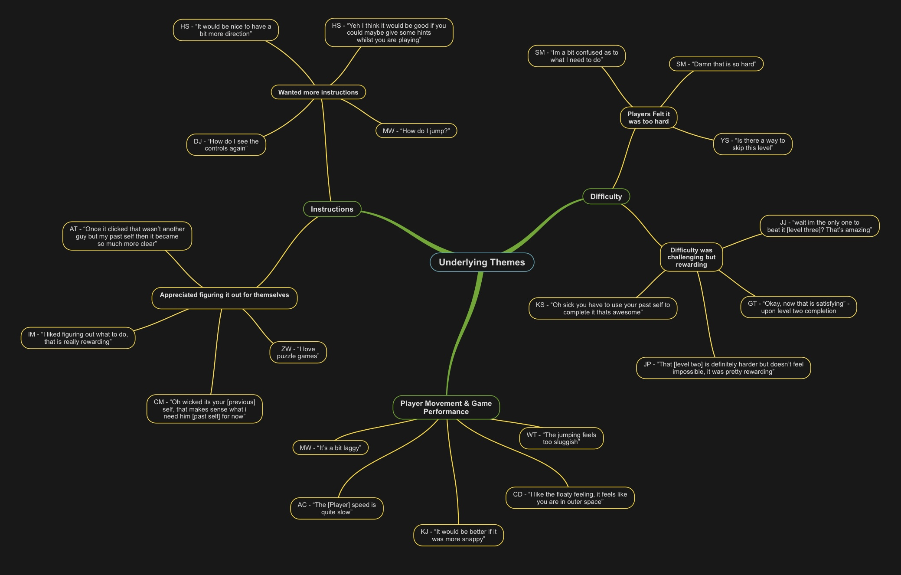

**Player Movement**

Much of the feedback was about the movement, and we identified:
•	Felt sluggish
•	Performance was too slow
•	“Space like” floaty feeling
Whilst not being our original setting for the game, this feedback inspired us to set the game in space (see Figure 15). Additionally, we incorporated the Java FX framework (REF) which gave the game drastically improved performance allowing for more responsive movement, providing a faster paced and exciting gameplay experience. 

  <b>Figure 15</b> 
  <i>Different Game Backgrounds</i> 
  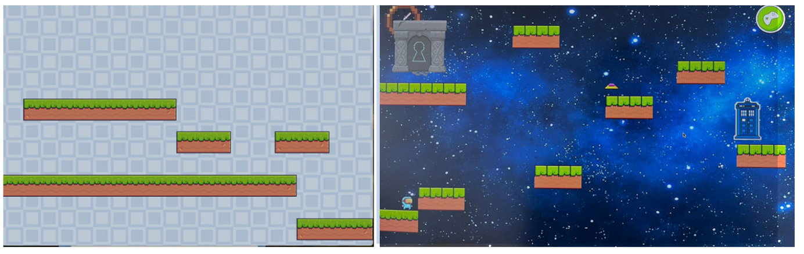

**Difficulty**

We found a mix of opinions regarding the difficulty level of the game.
•	Difficulty was rewarding but challenging
•	Level Two was very hard to complete for most players

To address the difficulty concerns, we decided to alter some of the platforms in Level Two which allowed for easier ways to avoid obstacles.

**Instructions**

We deliberately opted to not give much information as to what the player is required to do as we felt like it was better to let them figure it out themselves, which was met with mixed responses:
•	People liked the puzzle solving aspect
•	They found it rewarding solving the first level using past self
•	Some people wanted more instructions
We decided to implement visual hints on screen which offered clues as to how to beat the first level yet remaining vague enough to still offer rewarding gameplay (see Figure 16).

  <b>Figure 16</b> 
  <i>Example Hints</i> 
  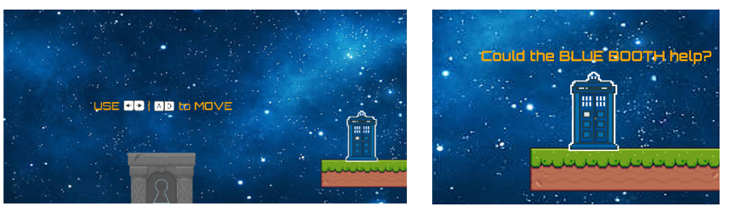

**Quantitative Analysis**

After examining our own video game preferences alongside findings from previous studies suggesting that game difficulty can improve a player's enjoyment when it is challenging yet not overly frustrating, (Alexander et al., 2013), it was important we were able to create a game which increased in difficulty each level. To measure whether our levels scaled in difficulty, data was gathered using the NASA Task Load Index (TLX) which has been shown to be highly reliable in many areas of Human Computer Interaction (HCI) including video game difficulty assessment (Hart & Staveland, 1988; Ramkumar et al., 2016; Seyderhelm & Blackmore, 2023). Each partiocipant filled out a TLX upon completion of each level (see Table 1).

  <b>Table 1</b> 
  <i>Participant NASA TLX Scores</i> 
  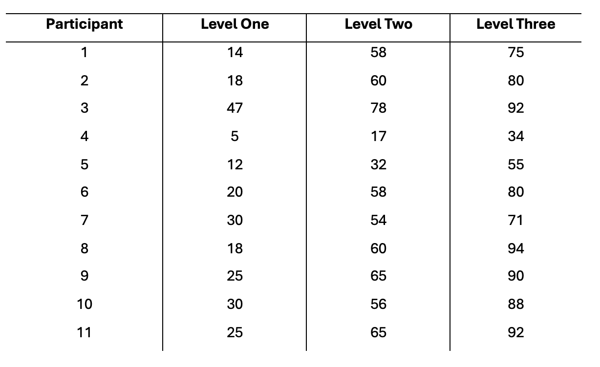

    

The data was analysed using R*Studio (RStudio Team, 2020). We expected each participant to report significantly increased on the workload on the following level compared to the previous. Wilcoxon Signed Rank tests were conducted to assess changes in perceived workload between the three levels.  The results of these indicated that there was a statistically significant increase in the TLX scores from Level One to Level Two, W = 0, p = .0035, and from Level Two to Level Three (W = 0, p = 0.0038). Every participant reported an increased workload for the following level compared to the previous, as per our design (see Figure 17 for participant specifics and Figure 18 for mean scores).

  <b>Figure 17</b> 
  <i>Raw NASA TLX Scores by Participant</i> 
  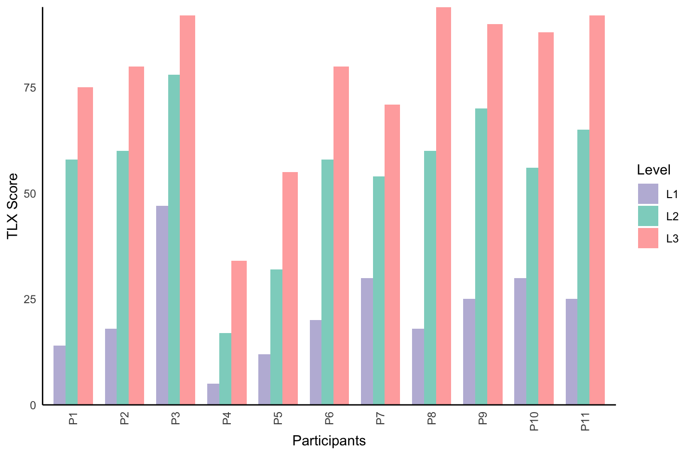

  <b>Figure 18</b> 
  <i>Mean NASA TLX Scores by Level</i> 
  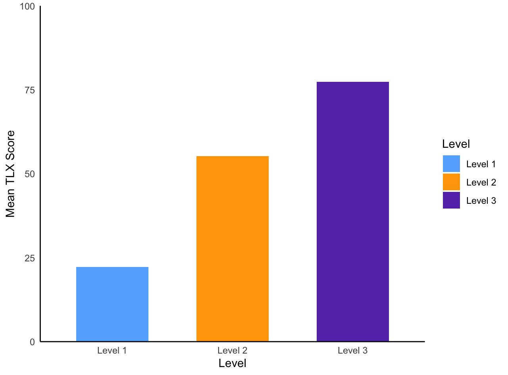

**Description of how code was tested**

Our strategy for testing the code involved a series of both black box and white box methods.
Whitebox tests were conducted by writing assertions which tested the correct initialisation of every object, and that variables held their expected states. See figure X for some examples of these. Most of the testing was done through backbox methods, utilising play testing from users during evaluation, and regular playtests from each team member. 

-	Mention testing specification
As the codebase grew in complexity, we drew up a testing specification 

o	Explain the methods used to test the code.
o	Blackbox
o	Whitebox
	Ali added assertions
	In class called test
o	Testing harness
o	Equivalence partitioning

# 7. Process 
## Collaboration

Our first few meetings were conducted in person. This allowed maximal flexibility as we discussed various design ideas and got to know each other. In fact, our first meeting ever was at a restaurant, and we focused exclusively on getting to know each other and our gaming histories. We connected in person at the end of each Monday morning lab, and divided up that week’s tasks using a variant of planning poker. (We noticed that development tasks would take different people different amounts of time, so we attempted to give harder tasks to faster coders even out how much time people spent on the game.)

Over the holidays, we switched to doing scrum-style stand-up meetings (at least 3 times a week) over Microsoft Teams. These have been shown to be effective in a remote context (Cucolaş and Russo, 2023), and this was also true for us. In contrast to our in-person meetings, which could be very long, these tended to be shorter and more agenda-driven - we would focus on what work needed to be done and by whom. This allowed people to work asynchronously in a way that seemed to reduce stress whilst still having frequent check-in points to ask for help or to pair program.

Early on, we had to decide which game to build. To do this, we used a [ranked preferences voting tool](https://www.rankedchoices.com/), which allowed each of us to express our preferences anonymously. 

Analysing our process, we noticed an interesting trend in the burndown report. For our three holiday sprints we set deadlines for the end of the week. This led to a few "heroic efforts" as people implemented their work before the deadline. (Note that there is some reporting bias in this, as we credited work done over the weekend to the previous Friday.) We mitigated this slightly in the final week of the holiday sprints, where we further decomposed the tasks (average story points per task went from 7 to 2.)

## Tools and Techniques

We experimented with a variety of different tools during the development.

For our meetings, we used a Google doc in reverse chronological order (a stack, not a queue!) This allowed us a space to add text, images, and diagrams flexibly and ensured that the most useful content was at our fingertips.

We initially used the Kanban board built into GitHub. However, as development became more complicated, we noticed that people were misunderstanding the requirements of the task, leading to wasted development time. We decided to switch to the running Google doc that we used for meetings as it allowed us to use a variety of media (text, images of paper prototypes etc) to describe the task requirements. This was significantly more flexible, and our PR workflow meant it was still very easy to track what work had been done for analysis purposes. It also reduced the number of places people needed to look for information - everything was centralized in one document.

We used Pull Requests extensively. Our process involved creating a PR and having another team member review it before it could be merged in. This helped enforce good coding standards and reduced the likelihood of committing buggy code.

WhatsApp was our primary communication method, which we used to coordinate meetings, ask for feedback on PRs, and ask for help.

Pair programming was something that we used frequently. Since Yi had previous experience with game development, pair programming with him allowed us all to get up to speed with some of the techniques that we would later rely on. He would act as the tactician and we would be the helm. Early on we did a variant of pair programming where we used the VS Code plugin Live Share to collaborate on the same code in real-time. This allowed for very fast coding development early on and meant our meetings were more “working sessions” than meetings.

## Agile Discussion

We adopted an agile methodology, allowing us to build the game slowly based on user feedback. This was very effective, especially since many of us had little knowledge of game development. However, we did encounter some issues. Early on, the pressure to get a feature "working" overrode the desire to create long-term, maintainable code. You can see this with the collision detections, the initial code had to be rewritten to be extensible. We addressed this by implementing a workflow based on pull requests and code reviews. Inspired by industry best practices, code reviews allowed each of us to uplevel our skills and write significantly better code as measured by cyclomatic complexity (which decreased by 79% between the 3rd week of the project and the 7th.)

# 8. Conclusion 

Developing Oiram challenged and enhanced our software engineering capabilities. We crafted a sophisticated system architecture that included map design, a stylised interface, accessibility features, and innovative mechanics like time reversal, resulting in a game that closely matched our vision.

Early in the project, we established our game's vision, though the complexity of our codebase evolved. Maintaining a supportive environment was therefore vital, with senior developers providing guidance and using diagrams to ensure all team members, regardless of skill level, understood the system. This facilitated feature integration and allowed team members to cover for each other.

Adopting an Agile development methodology was also instrumental for designing the game we envisioned, satisfying our user stories, and importantly, creating something that was fun to play. User feedback was pivotal, influencing the game’s setting and difficulty. This feedback enabled us to fine-tune levels and add hints, leading to a game that was enjoyable, challenging, and satisfying for players.

During development, our team encountered a series of challenges such as the implementation of the games core mechanics, implementing accessibility mode, and successfully balancing map design with difficulty level. These challenges were overcome by regular team meetings and the assignment of clear team roles. Despite all coming from different academic backgrounds and holding different levels of programming proficiency, we were able to capitalise on each other’s strengths, which fostered a supportive and efficient development lifecycle. 

However, there are some areas we would have changed. Adopting a Test-Driven Development process from the project’s inception would have greatly enhanced our ability to debug. Due to our system architecture, it made the separation of the display and data very difficult, forcing us to find many bugs solely through playtesting. Shifting our design pattern to one such as the Model View Controller would likely have provided us with an easier process of error detection. These are valuable lessons that we will take forward into future projects. 

Looking forward for Oiram itself, we have numerous features we would still like to implement. A musical score could support the science fiction setting, and sound effects for various gameplay scenarios, such as explosions and player death, would help improve immersion. Given a larger development team, or an extended deadline, we would aim to have implemented more levels of increasing difficulty, such as a boss fight which would require both past and present versions of the player working together to defeat it. Concept art and conceptual level designs for some of these ideas can be found in Appendix X.

This project has provided each team member the chance to develop both their team working, and software engineering abilities. Developing Oiram has been our first experience of undertaking a team-based software engineering project. Each member would agree that this project has been invaluable, and we will take what we have learned into our future careers.

**Table of Contributions**
- **Mihir**: 1.00
- **Tom**: 1.00
- **Ali**: 1.00
- **Yi**: 1.00
- **Kaiyan**: 1.00

# 9. References

Alexander, I. (2004). A Better Fit—Characterising the Stakeholders. (p. 223-233).

Alexander, I. F., & Beus-Dukic, L. (2009). Discovering Requirements: How to Specify Products and Services. Wiley. https://books.google.co.uk/books?id=KMZYFzgbXSwC

Alexander, J. T., Sear, J., & Oikonomou, A. (2013). An investigation of the effects of game difficulty on player enjoyment. Entertainment Computing, 4(1), 53–62. https://doi.org/10.1016/j.entcom.2012.09.001 

Braun, V., & Clarke, V. (2006). Using thematic analysis in psychology. Qualitative Research in Psychology, 3(2), 77–101. https://doi.org/10.1191/1478088706qp063oa 

Cucolaş, A.-A., & Russo, D. (2023). The impact of working from home on the success of Scrum projects: A multi-method study. Journal of Systems and Software, 197, 111562. https://doi.org/10.1016/j.jss.2022.111562

Davis, A. M. Alan M. (1993). Software requirements: Objects, functions, and states. Englewood Cliffs, N.J. : PTR Prentice Hall. http://archive.org/details/softwarerequirem0000davi

Hart, S. G., & Staveland, L. E. (1988). Development of NASA-TLX (Task Load Index): Results of empirical and theoretical research. Advances in Psychology, 139–183. https://doi.org/10.1016/s0166-4115(08)62386-9 

Heydarian, C. H. (2020). The Curb-Cut Effect and its Interplay with Video Games. Arizona State University.

Joe, J., Chaudhuri, S., Le, T., Thompson, H., & Demiris, G. (2015). The use of think-aloud and Instant Data Analysis in evaluation research: Exemplar and lessons learned. Journal of Biomedical Informatics, 56, 284–291. https://doi.org/10.1016/j.jbi.2015.06.001 

Nielsen, J., Clemmensen, T., & Yssing, C. (2002). Getting access to what goes on in people’s heads? Proceedings of the Second Nordic Conference on Human-Computer Interaction. https://doi.org/10.1145/572020.572033 

Petrillo, F., Pimenta, M., Trindade, F., & Dietrich, C. (2009). What went wrong? A survey of problems in game development. Computers in Entertainment, 7(1), 1–22. https://doi.org/10.1145/1486508.1486521

Ramkumar, A., Stappers, P. J., Niessen, W. J., Adebahr, S., Schimek-Jasch, T., Nestle, U., & Song, Y. (2016). Using GOMS and NASA-TLX to evaluate human–computer interaction process in interactive segmentation. International Journal of Human–Computer Interaction, 33(2), 123–134. https://doi.org/10.1080/10447318.2016.1220729 

Rasheed, A., Zafar, B., Shehryar, T., Aslam, N. A., Sajid, M., Ali, N., Dar, S. H., & Khalid, S. (2021). Requirement Engineering Challenges in Agile Software Development. Mathematical Problems in Engineering, 2021, 1–15. https://doi.org/10.1155/2021/6696695

Said, S., Gozdzik, M., Roche, T. R., Braun, J., Rössler, J., Kaserer, A., Spahn, D. R., Nöthiger, C. B., & Tscholl, D. W. (2020). Validation of the Raw National Aeronautics and Space Administration Task Load Index (NASA-TLX) questionnaire to assess perceived workload in patient monitoring tasks: Pooled analysis study using mixed models. Journal of Medical Internet Research, 22(9). https://doi.org/10.2196/19472 

Seyderhelm, A. J. A., & Blackmore, K. L. (2023). How hard is it really? assessing game-task difficulty through real-time measures of performance and cognitive load. Simulation &amp; Gaming, 104687812311699. https://doi.org/10.1177/10468781231169910 

Virtanen, K., Mansikka, H., Kontio, H., & Harris, D. (2021). Weight Watchers: NASA-TLX Weights revisited. Theoretical Issues in          Ergonomics Science, 23(6), 725–748. https://doi.org/10.1080/1463922x.2021.2000667 
 

