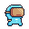
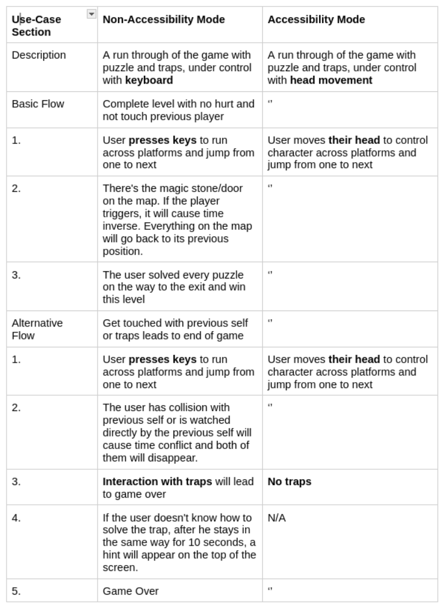

# How To Install And Set Up
For our game you need Processing, as well as the "Video", "Deep Vision" and "Sound" libraries. They can be installed by going through the Library Manager. Select “Add Library...” from the “Import Library...” submenu within the Sketch menu. Then search for each of the three libraries by name and install it. See this tutorial for more information. https://processing.org/tutorials/video

Note: the Processing video library is not supported on Linux. For the full game experience (including accessibility mode), please play using a Mac or PC.

# Video
https://youtu.be/J3RTHQjeOvg

# Table of Contents
- [1. Development Team](#1-development-team)
- [2. Introduction](#2-introduction-)
- [3. Requirements](#3-requirements-)
- [4. Ideation Process](#4-design-)
- [5. Implementation](#5-implementation)
- [6. Evaluation](#6-evaluation-)
- [7. Process](#7-process-)
- [8. Conclusion](#8-conclusion-)
- [9. Acknowledgements](#9-acknowledgements)
 
# 1. Development Team
<p align="center">
  <b>Figure 1</b><br>
  <i>Team Picture Week 1 with team role</i><br>
  
</p>

### Team Role (from left to right of image):

| Name    | Role          | Contributions |
|---------|---------------|---------------|
| `Mihir` | `Dev Ops Lead`  | Built out our tooling and served as our in-house GitHub expert, pioneering our crucial PR-based workflow to minimize Git related issues. |
| `Tom`   | `Lead Designer` | Created interactive iPad demos for potential levels and provided expert analysis during playtesting. |
| `Ali`   | `Scrum Master`  | Encouraged team communication and evaluated tasks for sprint prioritization, ensuring smooth workflow. |
| `Yi`    | `Developer`     | Contributed significantly to game development and shared expertise, enhancing the team's development skills. |
| `Kaiyan`| `Developer`     | Focused on dynamic tooltips in the tutorial level, improving player comprehension and engagement. |

# 2. Introduction 
### About Oiram:
<div style="text-align: center;">
  
</div>
<p>
Oiram is a single-player, platform-oriented game that integrates Super Mario-style missions and a time-travel feature. Our spaceman must navigate obstacles such as explosives and determine the most efficient path through the game. Drawing inspiration from Nolan's Tenet, the Tardis object allows for time reversal. The missions are intricately designed and problem-oriented.
</p>

### How to Play:
<div style="display: flex; align-items: center; justify-content: center;">
  <p style="margin-right: 20px;">
    <b><i>Use the arrow keys or WASD to direct your spaceman: D/A for lateral movement, W or Up to ascend.</i></b>
  </p>
  
</div>

**The Mission:**
Navigate levels, dodge obstacles, and interact with objects like gates, switches, and the Tardis to activate mechanisms and portals.

<div style="display: flex; justify-content: space-around; text-align: center;">
  <div style="padding: 10px;">
    <h3>Gates</h3>
    
    <p><i>Act as portals to the next level.</i></p>
  </div>
  <div style="padding: 10px;">
    <h3>Switches</h3>
    
    <p><i>Toggle to control various game mechanisms.</i></p>
  </div>
  <div style="padding: 10px;">
    <h3>Tardis</h3>
    
    <p><i>Device to invoke time reversal.</i></p>
  </div>
</div>

**Obstructions:**
Avoid explosives and pits to ensure survival.

**How to Win:**
Master gravity and momentum to navigate through the level, taking into account the actions of your past self.

### Oiram Game Inspiration:
Oiram's narrative complexity is inspired by Tenet, the timeless platforming of Super Mario, and the temporal challenges of Braid, offering a unique gameplay experience.

### Why Play Oiram?
Oiram stands out by combining classic platforming with innovative time manipulation and prioritizing accessibility with features tailored to a range of player needs.

# 3. Requirements 
### Introduction to Requirement Engineering (RE)
“The two most important parts of a computing system are the users
and their data, in that order.” Neville Holmes. (Alexander & Beus-Dukic, 2009, p. 27).

Requirements Engineering (RE) is a communication mechanism that ensures that client needs are prioritised during early-stage design of the Software Design Life Cycle (SDLC) (Rasheed et al., 2021, pp. 1–2). RE holds particular significance in game development, where a postmortem analysis of software engineering conducted by Petrillo (2009, pp. 18–20), finds that 75% of game development case studies reported the most common issues are unrealistic or ambivalent
scope and feature creep.


<p><i>Figure 1. Petrillo's (2009) study mapping problems found in Game Development to its occurances.</i></p>

Later in this report, we will reflect on our experience of similar issues. Users perceived our initial approach as overly complicated, which led to time management inconsistency (Rasheed et al., 2021, p. 6) and poor client satisfaction, potentially creating a breach of contract (Davis, 1993, p. 15). Thus, we knew that the success of Oiram depended on high-quality RE. The following section discusses the models used to produce the RE analysis for our game, reflected upon the roadmap below:


<p><i>Figure 2. RE Roadmap for Section Three of Oiram Game Report.</i></p>

<h3>Ideation Processing</h3>

<p><i>Figure 3. Week 2 Brainstorm for two game ideas.</i></p>
<p>
    In our ideation phase, we collaboratively utilised 
    <a href="https://miro.com/app/board/uXjVNv7hy3o=/?share_link_id=24285523794" target="_blank">Miro</a> 
    (Figure 3) and 
    <a href="https://docs.google.com/document/d/1oLEtyGP2DT71ntCW57uqrKU6U0Af0hguWeTmZLABD5E/edit?usp=sharing"Docs target="_blank">Docs</a>
    to brainstorm two initial game ideas. We wanted to incorporate a 'Tenet'-inspired theme into our game, reflecting our shared interest in Nolan's cinematic exploration of time. For the game genre, our group gravitated towards platforms (similar to Mario) and puzzle problem-solving genres, creating a consensus for a game that marries these genres with a Tenet-style narrative twist. During week 3 of designing paper prototypes of the two ideas, Dr. Benette provided feedback and observed similarities between our concept and the Steam game 
    <a href="https://store.steampowered.com/app/1416720/Brain_Games/" target="_blank">Braid</a>.
    This feedback propelled us towards Idea 2, as demonstrated by our 
    <a href="https://www.youtube.com/watch?v=U_D2pebtMJo" target="_blank">paper prototype</a>, 
    which intrigued us with its potential for innovative gameplay mechanics. Thus, effective collaborative tools setup, a weekly time and place decided, and paper prototyping allowed quality ideation processes, preparing us to innovate further by looking at stakeholder planning next.
</p>


### Identifying Stakeholders (Onion Model)
Following the ideation phase, stakeholder analysis would help us design a customer-oriented game and understand boundary management, ensuring that we remain <u>focused on placing the <b>user first</b></u> and <u>not engineering an overly complex game</u>. The Onion Model, a structured approach to stakeholder research, helped us identify and prioritise our game's stakeholders based on their proximity to the project and level of impact. We placed **Puzzle Enthusiasts** at the model's core, mainly based on our primary stakeholders, our CS professors, who determine the projects' final grades. As these professors have a CS background, we wanted to create the experience that the game levels are more challenging than expected, as professors have seen many student game projects, so we wanted to stand out.

In the middle layers, we placed **Casual Gamers** and **Competitive Gamers**. Whilst the game is easy to use for anyone, and so can be pitched to a large group, we knew we needed to consider its accessibility and ease of use. Thus, we discovered we would need a clear tutorial and modern game UX. At the same time, competitive gamers encouraged the development of difficult aspects and score systems to foster a competitive environment.

External layers include considering regulatory agencies and gaming communities, as we wanted to put the project on our portfolios after completion. Both of these require compliance and community involvement norms. These externalities serve as a reminder to keep our designs flexible to accommodate greater user feedback and regulatory needs, maintaining broad appeal and compliance. The Onion Model thus not only drove the construction of our user stories but also inspired our strategic focus on stakeholder interests throughout the game's development process.

### Identifying Top-Level Needs (User Stories)
<p align="center">
  
  <br>
  <i>Figure 3: User Story 1</i>
</p>

<p align="center">
  
  <br>
  <i>Figure 4: User Story 2</i>
</p>

<p align="center">
  
  <br>
  <i>Figure 5: User Story 3</i>
</p>

### Use-Cases Breakdown 
Having established a 'Casual Gamer' focus, we understood early on in the game development process the difficulties when making a game to a large group of customers. Therefore, we used the Use-Case Diagram and Specification model as a guide to create a dual mode gameplay system that includes an accessibility mode in order to increase our reach and provide additional features. While the game uses standard keyboard controls in Non-Accessibility Mode, it makes use of **Camera Detection technology** in Accesibility Mode to let players with disadvantages to control the game with head motions. This innovation is in line with our commitment to diversity and improves accessibility for those with limited mobility.

Both modes, which have different interaction methods but comparable goals and obstacles, are demonstrated below:
<p align="center">
  
  <br>
  <i>Figure 5: Use Case Diagram</i>
</p>

<p align="center">
  
  <br>
  <i>Figure 6: Use Case Specification</i>
</p>


# 4. Design 
Having evaluated our potential stakeholders and evaluated a diverse range of User Stories, we now had a sense of the features we wanted to incorporate into out Game design, as well as the Use-Case Diagram/Specification providing us how we can specialise into accessibility features.

A **Class Diagram** would provide a systematic view of of our Game System, allowing us to plan ahead and template the relationship between objects, which would serve as planning for good **Object-Orientated Design (OOD)** within our source code. To do so, we first wrote down a plan for System Architecture by callaborating in-person through Whiteboard sessions (see Section 7). This allowed for the Class Diagram formation to be a seemless process. 

Following the Class Diagram, we worked on forming a **Sequence Diagram**, which would indicate the order of objects working together. This is particularly significant in Game Development, where having evaluated many classes in our system, the sequence would allow for ease in debugging, especially where the Processing IDE has poor debugging facilities. 


Find below how we evaluated Design for Oiram, later following an evaluation and reflection: 
### System architecture 
# Project Overview

Based on the requirements specification, we developed a system architecture that begins with a user-interface menu. Here, players can start the game, select levels, or activate an alternative control mode tailored for users with disabilities, such as Carpal Tunnel Syndrome. We achieved this by utilizing webcam inputs via the Deep Vision and Video Processing library. The system employs visual cues to indicate player damage and potential movements in-game.

## Game Mechanics

The complex mechanics of time inversion in our platform-puzzle game necessitated the design of multiple components:

- **Game Object**: Includes several subclasses such as platforms, players, and interactable items.
- **Player Controller**: Manages player interactions and states.
- **Map and Map Controller**: Handle the layout and logic of game levels.
- **Main Class**: Manages the game loop, flags for method calls, and oversees the creation of Player Controller and Map Controller instances. These controllers maintain method control flags and item lists.

## Cross-Platform Library Challenges

A challenge we faced included figuring out how to get the libraries to work cross-platform, across MacOS, Linux, and Windows. These issues came due to outdated packages within Processing Libraries across OS platforms. For instance, particularly for the Video library, whilst working on macOS, Linux would give the error:

```bash
(Processing core video:295602): GStreamer-WARNING **: 17:27:43.028: Failed to load plugin '/home/mihirgany/IdeaProjects/2024-group-18/libraries/libraries/video/library/linux-amd64/gstreamer-1.0/libgsthls.so': libcrypto.so.1.1: cannot open shared object file: No such file or directory
```
### Class diagrams 

<p align="center">
  
  <br>
  <i>Figure 7: Class Diagram Generated W5 Labs.</i>
</p>

<p align="center">
  
  <br>
  <i>Figure 8: Updated Class Diagram to date.</i>
</p>

Figure 7 and 8 indicates how our Class Diagram changed over time. In particular, when first trying out player movement, we found that collisions was particularly difficult to program, due to...

Therefore, once collision became easier to program, more classes were incorporated into the diagram, such as the Bomb class.

### Behavioural diagrams 
<p align="center">
  
  <br>
  <i>Figure 8: Sequence Diagram</i>
</p>
When creating the Oiram game, we embraced OOD and Agile methodologies to evolve our game's design continuously. This approach required frequent updates to our system architecture, class, and sequence diagrams, essential tools for visualising and understanding the game's structure and interactions. However, the fast pace of Agile development meant that these foundational documents often needed to catch up to the latest game adjustments, showcasing a key challenge of Agile: maintaining up-to-date design documentation amidst rapid changes.

Looking ahead, to better balance the need for quick adaptations with the necessity of thorough planning, we propose integrating periodic reviews into version control and consider continuously pushing to our report and source code. Although this comes as a challenge because this is our first game project, we experimented late into the project tools such as  [Intelij's Diagram Plugin](https://www.jetbrains.com/help/idea/class-diagram.html) by rewriting .pde to .java, which would have saved time and provided consistency within minimal effort. Additionally, although we stayed consistent with lab work, and ensuring that we incorporated it into the report, we ended up using that content as a plan. Whereas a more effective strategy would have been building on what we already had, and seeking feedback by the end of next week. Overall the importance of consistency is highlighted during Game Design. 
# 5. Implementation

Before starting any of our challenges, we needed to create a basic platformer. First, we created a `GameObject` from which all physical items in the game inherit, as well as a `Player` (which includes specific player behaviour) and a `PlayerController` (which includes the logic for how the player is controlled).

While not one of our official challenges, we found that programming collisions and basic movement were initially quite tricky. For example, our initial approach to jumping caused an issue where users could jump infinitely by holding down the button. Our eventual implementation involved a variable within the `Player` set when they were on the ground. We also included velocity and acceleration variables. For collisions, initially, we had an approach involving an ENUM, several for loops, and several if statements. This approach was verbose and unreliable (occasionally players would fall through the floor!) Our final approach was much simpler and involved using the height and width of the game object, with the conditional collisions logic (for example, pressing the button opens the door) stored inside the `interactDynamicItems` method.

### Challenges

1. **Implementing the reverse time mechanic**

   This was by far the hardest task. We wanted to store not just the previous player's locations but also have that player interact with the environment (for example, opening doors). We created a `PastPlayer` class containing a Linked List of the player's previous locations. We used a frame variable to keep track of time within the object. To reduce the amount of code we had to write, we took advantage of our existing Player class. This object contained the logic for collisions with buttons and other game objects since the implementation is the same.

   The bomb was even more complex. We created explode and unexplode animations, and we also overrode the `checkCollisions` function to have a broader blast radius.

2. **Level Design and balance**

   We realized early on that we wanted to build the level map in an extensible way, so the `Map` class contains a function that reads a text file representing the map. This allowed maximal flexibility whilst developing our maps, especially as core game mechanics like jump height were being changed. We opted not to use procedural generation, as we felt control was important given the puzzle-solving nature of the game. This is because we found that many decisions, like where a button is located, can profoundly affect a player's ability to complete a particular puzzle.
   
    
    
    
   This level designer was very helpful when in playtesting. For example, one user found the jump in the tutorial level too challenging to complete, but with a few keystrokes, we were able to change it and immediately gather feedback that the same user found it easier.
   
4. **Accessibility**

   Accessibility was a really important aspect for us, as we have team members with personal experience of their disability locking them out of games. So, we built a way to play the game without keyboard input. Players can lean left and right and make a noise to jump. This was implemented through a machine vision and audio library. Input from the webcam is taken and if the user's head is detected on one side of the screen, the character moves that way. The main challenge of this was efficiency, the first library we used was too slow, as it was doing pose detection. We switched to just detecting the head position, and the game worked. Audio input was taken using Processing’s sound library, and if it spikes over a certain level a jump signal is sent to the player character.

   One other issue we encountered whilst testing this was that the Processing video library isn't supported on Linux machines. To fix this, if the user is on Linux, we  show an error message if they attempt to load accessibility mode. Since loading the libraries takes 5-10 seconds, we needed to implement an additional loading screen to provide adequate visibility of system status.

   Whilst the `AlternativeController` class contains about 100 lines of code, it required us to add only a few lines to the rest of the game (from the perspective of the player controller, it is just a few more variables that it handles in the same way as a button press.) This shows that many games that use simple keyboard inputs could have accessibility modes like this one.

   In playtesting, some non-disabled players preferred controlling the character this way. This is known as the curb-cut effect; a feature originally built for accessibility can be useful for other players. (Heydarian, 2020)


# 6. Evaluation 
  During the development process, it was essential to understand whether the game's fundamental mechanics, namely the movement physics and the time inversion, offered fun gameplay while also presenting a satisfying challenge. To do this, we utilised a mixed-methods approach using inferential statistics enriched by questionnaire data. 

  Our game aims to reward future planning and puzzle-solving. After examining our own video game preferences, and a literature review which suggested that game difficulty can improve overall enjoyment when it is not overly frustrating and provides a satisfying challenge to overcome (Alexander et al., 2013). [Tom - I need to make this better] It was, therefore, important that we accurately assessed the perceived difficulty. To examine whether two of our levels differentiated in complexity, data was gathered using the NASA Task Load Index (Hart & Staveland, 1988). The Task Load Index (TLX) is a questionnaire which asks participants to record their perceived physical and cognitive workload when completing a task, and has been shown to be highly reliable in many areas of Human Computer Interaction (HCI) including video game difficulty assessment (Ramkumar et al., 2016; Seyderhelm & Blackmore, 2023).

  Eleven participants (N = 11), consisting of six males and five females, were collected via convenience sampling. Participants were randomly assigned to complete Level One or Level Two first to avoid issues of training bias (NEED REF). Level One was designed to be the easier of the two. Upon completion (determined by the participant), we administered the TLX. The process was repeated for Level Two, giving us two TLX scores for each participant (see Table X). We chose not to use the weighted TLX scores as some research has suggested that raw TLX scores have improved validity whilst also being easier to administer (Said et al., 2020; Virtanen et al., 2021).

<p align="center">
  <b>Table X</b><br>
  <i>Participant NASA TLX Scores</i><br>
  
</p>
    

  The data was analysed using R*Studio (RStudio Team, 2020) and we expected each participant to report significantly increased workload on Level 2 compared to Level 1. A Wilcoxon Signed Rank test was conducted to assess TLX score differences between the two levels. The results indicated a statistically significant increase in the TLX scores from Level One to Level Two, V = 0, p = .00348. Participants reported a significantly increased workload for level Two (mean TLX score = 55) compared to Level One (mean score = 22), indicating an increase in difficulty (see Figure X).

<p align="center">
  <b>Figure X</b><br>
  <i>Box Plot Depicting Raw NASA TLX Scores</i><br>
  
</p>

To enrich the data gathered through the NASA TLX, and to further guide the development process, we conducted the qualitative evaluation technique of Think Aloud (TA). TA requires participants to verbally express their thoughts, feelings, and emotions whilst performing a given task, and has been shown to be an effective evaluation method in many areas of HCI (Nielsen et al., 2002; Joe et al., 2015). We utilised TA to assess whether the difficulty level was where we planned it to be, and to potentially identify any features or issues we may have overlooked.

Seventeen participants were collected again through convenience sampling. Due to easy access to a large pool of other students, we opted for this over Heuristic evaluation. This also gave us a wider variety of different experiences and abilities regarding video games, offering a richer set of data. Whilst each participant was playing, we noted down their thoughts, or recorded their session for later transcription. Following this, we assessed each transcript to find any thoughts which were shared between participants and organised them into underlying themes utilising techniques found in Thematic Analysis (Braun & Clarke, 2006). After sufficient themes had been identified, they were organised into a Thematic Map for easier visualisation (see Figure X).

<p align="center">
  <b>Figure X</b><br>
  <i>Thematic Map of Think Aloud Data</i><br>
  
</p>


This data was instrumental in our development approach, and much of the qualitative data we gathered directly influenced our design choices. We will address each theme in turn.

Player Movement

During early playtesting, when the aesthetic of the game hadn’t yet been  decided, much of the TA feedback we received was instrumental for guiding the style of the game itself. Multiple participants commented on how the player movement felt “sluggish” and gave them a “floaty feeling” , with another describing it as feeling “like you are in outer space”.  Whilst not being our original setting for the game, this feedback inspired us to set the game in space, whilst also negating the need to alter the physics and potentially having to redesign levels. The alpha build background and the subsequent space setting are shown in Figure X.

<p align="center">
  <b>Figure X</b><br>
  <i>Different Game Backgrounds</i><br>
  
</p>


Difficulty 

We found mixed responses to the difficulty levels with many players enjoying the reward of completing the levels.

“That [Level Two] was definitely harder … it was pretty rewarding”

“Okay now that was satisfying”

However, other players commented on how they felt like the second level especially was too challenging, with one participant asking, “Is there any way to skip this level” and another stating, “damn, that is so hard”. Despite this mixed feedback, we chose to keep the design of the second level, as we felt it was more in line with our vision for a rewarding science fiction platformer, and the mixed responses likely reflected the differing video game abilities that our pool of participants had. 


Instructions

We deliberately opted not to give much information about what the player is required to do, as we felt it was better to let players figure it out for themselves, which was again highlighted in the TA data.

“I liked figuring out what to do, that is really rewarding”

“Once it clicked … it became so much clearer”

However, others claimed they would prefer slightly more instructions on how to progress through the level and how to view the controls again.

“How do I see the controls again”

“I think it would be good if you could maybe give some hints whilst you are playing”

“It would be nice to have a bit more direction”

We took some of this feedback and then included some visual hints on the screen, which offered some clues as to how to beat the level. We carefully calibrated these hints to provide the minimal information possible for users to complete the level while maintaining the positive feelings users got on completion of the unhinted level - the "aha" moment. (see Figure X).

<p align="center">
  <b>Figure X</b><br>
  <i>Example Hints</i><br>
  
</p>


# 7. Process 
## Collaboration

Our first few meetings were conducted in person. This allowed maximal flexibility as we discussed various design ideas and got to know each other. In fact, our first meeting ever was at a restaurant, and we focused exclusively on getting to know each other and our gaming histories. We connected in person at the end of each Monday morning lab, and divided up that week’s tasks using a variant of planning poker. (We noticed that development tasks would take different people different amounts of time, so we attempted to give harder tasks to faster coders even out how much time people spent on the game.)


Over the holidays, we switched to doing scrum-style stand-up meetings (at least 3 times a week) over Microsoft Teams. These have been shown to be effective in a remote context (Cucolaş and Russo, 2023), and this was also true for us. In contrast to our in-person meetings, which could be very long, these tended to be shorter and more agenda-driven - we would focus on what work needed to be done and by whom. This allowed people to work asynchronously in a way that seemed to reduce stress whilst still having frequent check-in points to ask for help or to pair program.

Early on, we had to decide which game to build. To do this, we used a [ranked preferences voting tool](https://www.rankedchoices.com/), which allowed each of us to express our preferences anonymously. 

Analyzing our process, we noticed an interesting trend in the burndown report. For our three holiday sprints we set deadlines for the end of the week. This led to a few "heroic efforts" as people implemented their work before the deadline. (Note that there is some reporting bias in this, as we credited work done over the weekend to the previous Friday.) We mitigated this slightly in the final week of the holiday sprints, where we further decomposed the tasks (average story points per task went from 7 to 2.)


## Tools and Techniques

We experimented with a variety of different tools during the development.

For our meetings, we used a Google doc in reverse chronological order (a stack, not a queue!) This allowed us a space to add text, images, and diagrams flexibly and ensured that the most useful content was at our fingertips.


We initially used the Kanban board built into GitHub. However, as development became more complicated, we noticed that people were misunderstanding the requirements of the task, leading to wasted development time. We decided to switch to the running Google doc that we used for meetings as it allowed us to use a variety of media (text, images of paper prototypes etc) to describe the task requirements. This was significantly more flexible, and our PR workflow meant it was still very easy to track what work had been done for analysis purposes. It also reduced the number of places people needed to look for information - everything was centralized in one document.


We used Pull Requests extensively. Our process involved creating a PR and having another team member review it before it could be merged in. This helped enforce good coding standards and reduced the likelihood of committing buggy code.

WhatsApp was our primary communication method, which we used to coordinate meetings, ask for feedback on PRs, and ask for help.


Pair programming was something that we used frequently. Since Yi had previous experience with game development, pair programming with him allowed us all to get up to speed with some of the techniques that we would later rely on. He would act as the tactician and we would be the helm. Early on we did a variant of pair programming where we used the VS Code plugin Live Share to collaborate on the same code in real-time. This allowed for very fast coding development early on and meant our meetings were more “working sessions” than meetings.

## Agile Discussion

We adopted an agile methodology, allowing us to build the game slowly based on user feedback. This was very effective, especially since many of us had little knowledge of game development. However, we did encounter some issues. Early on, the pressure to get a feature "working" overrode the desire to create long-term, maintainable code. You can see this with the collision detections, the initial code had to be rewritten to be extensible. We addressed this by implementing a workflow based on pull requests and code reviews. Inspired by industry best practices, code reviews allowed each of us to uplevel our skills and write significantly better code as measured by cyclomatic complexity (which decreased by 79% between the 3rd week of the project and the 7th.)


# 8. Conclusion 

- **Mihir**: 1.00
- **Tom**: 1.00
- **Ali**: 1.00
- **Yi**: 1.00
- **Kaiyan**: 1.00


# 9. Acknowledgements

Alexander, J. T., Sear, J., & Oikonomou, A. (2013). An investigation of the effects of game difficulty on player enjoyment. Entertainment Computing, 4(1), 53–62. https://doi.org/10.1016/j.entcom.2012.09.001 

Alexander, I. F., & Beus-Dukic, L. (2009). Discovering Requirements: How to Specify Products and Services. Wiley. https://books.google.co.uk/books?id=KMZYFzgbXSwC

Braun, V., & Clarke, V. (2006). Using thematic analysis in psychology. Qualitative Research in Psychology, 3(2), 77–101. https://doi.org/10.1191/1478088706qp063oa 

Cucolaş, A.-A., & Russo, D. (2023). The impact of working from home on the success of Scrum projects: A multi-method study. Journal of Systems and Software, 197, 111562. https://doi.org/10.1016/j.jss.2022.111562

Davis, A. M. Alan M. (1993). Software requirements: Objects, functions, and states. Englewood Cliffs, N.J. : PTR Prentice Hall. http://archive.org/details/softwarerequirem0000davi

Hart, S. G., & Staveland, L. E. (1988). Development of NASA-TLX (Task Load Index): Results of empirical and theoretical research. Advances in Psychology, 139–183. https://doi.org/10.1016/s0166-4115(08)62386-9 

Heydarian, C. H. (2020). The Curb-Cut Effect and its Interplay with Video Games. Arizona State University.

Joe, J., Chaudhuri, S., Le, T., Thompson, H., & Demiris, G. (2015). The use of think-aloud and Instant Data Analysis in evaluation research: Exemplar and lessons learned. Journal of Biomedical Informatics, 56, 284–291. https://doi.org/10.1016/j.jbi.2015.06.001 

Nielsen, J., Clemmensen, T., & Yssing, C. (2002). Getting access to what goes on in people’s heads? Proceedings of the Second Nordic Conference on Human-Computer Interaction. https://doi.org/10.1145/572020.572033 

Petrillo, F., Pimenta, M., Trindade, F., & Dietrich, C. (2009). What went wrong? A survey of problems in game development. Computers in Entertainment, 7(1), 1–22. https://doi.org/10.1145/1486508.1486521

Ramkumar, A., Stappers, P. J., Niessen, W. J., Adebahr, S., Schimek-Jasch, T., Nestle, U., & Song, Y. (2016). Using GOMS and NASA-TLX to evaluate human–computer interaction process in interactive segmentation. International Journal of Human–Computer Interaction, 33(2), 123–134. https://doi.org/10.1080/10447318.2016.1220729 

Rasheed, A., Zafar, B., Shehryar, T., Aslam, N. A., Sajid, M., Ali, N., Dar, S. H., & Khalid, S. (2021). Requirement Engineering Challenges in Agile Software Development. Mathematical Problems in Engineering, 2021, 1–15. https://doi.org/10.1155/2021/6696695

Said, S., Gozdzik, M., Roche, T. R., Braun, J., Rössler, J., Kaserer, A., Spahn, D. R., Nöthiger, C. B., & Tscholl, D. W. (2020). Validation of the Raw National Aeronautics and Space Administration Task Load Index (NASA-TLX) questionnaire to assess perceived workload in patient monitoring tasks: Pooled analysis study using mixed models. Journal of Medical Internet Research, 22(9). https://doi.org/10.2196/19472 

Seyderhelm, A. J. A., & Blackmore, K. L. (2023). How hard is it really? assessing game-task difficulty through real-time measures of performance and cognitive load. Simulation &amp; Gaming, 104687812311699. https://doi.org/10.1177/10468781231169910 

Virtanen, K., Mansikka, H., Kontio, H., & Harris, D. (2021). Weight Watchers: NASA-TLX Weights revisited. Theoretical Issues in          Ergonomics Science, 23(6), 725–748. https://doi.org/10.1080/1463922x.2021.2000667 
 

TODO: Heuristics - noticed how players dont read tutorial and therefore incorporated into level.

